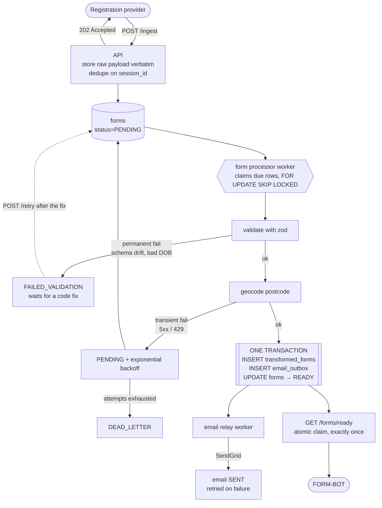

# Registration form ingestion pipeline

Ingests registration forms from a third-party provider, transforms them to the target schema, geocodes the postcode, and makes them available to the FORM-BOT. Handles duplicate deliveries, changes to the provider's schema, and outages in the downstream APIs.

Loom video demo
https://www.loom.com/share/e7da384a28594383b818232298bb100d

## Quick start

```bash
docker compose up -d --wait     # Postgres on :5433
npm install
cp .env.example .env
npm run db:migrate
npm test                        # 84 tests
npm run dev                     # API + workers on :3000
```

Requires Node 22 and any Docker runtime. Postgres is published on **5433** rather than 5432 so it won't collide with a local install.

## The four guarantees

The brief asks for four properties. Three are enforced by a database constraint rather than by application logic, which is harder to get right under concurrency, crashes, and replays; the fourth is a storage rule.

| Requirement | How it's guaranteed |
|---|---|
| Duplicate deliveries are harmless | `UNIQUE(session_id)` on `forms`, written via `INSERT … ON CONFLICT DO NOTHING RETURNING` — no read-then-write race |
| The FORM-BOT never sees a form twice | `UNIQUE(form_id)` on `transformed_forms`, plus an atomic claim: `SELECT … FOR UPDATE SKIP LOCKED` over undelivered rows, then stamp `delivered_to_bot_at`, both in one transaction |
| The email is guaranteed | Transactional outbox: `UNIQUE(form_id)` on `email_outbox`, inserted in the *same transaction* as the transform |
| Failures are capturable and replayable | The raw payload is stored verbatim before anything parses it, so any form can be re-run from scratch |

## How it works



`/ingest` returns **202 immediately** and does no processing. The provider's delivery succeeds even while the geocoder is down, so a form isn't dropped because a downstream API is unavailable. It also keeps the mock's 2s of latency off the request path.

## Downstream consumers

SendGrid is a notification we push. The FORM-BOT is the consumer of the transformed data, and it pulls.

| | SendGrid | FORM-BOT |
|---|---|---|
| Direction | We call them — `sendEmail` from the relay worker | They call us — `GET /forms/ready` |
| Carries | An internal "a form arrived" ping, with **no patient identifiers** — just the application reference and ids | The full transformed patient record: name, DOB, contact details, address, coordinates |
| Delivery guarantee | **At-least-once.** A lost response means a duplicate notification | **Exactly-once.** The claim stamps `delivered_to_bot_at` in the same transaction that returns the rows |

After the commit the two are independent: different worker, different table, different state machine. SendGrid being down doesn't delay the bot handoff.

## Design decisions

### Transient and permanent failures are treated differently

Every retry decision follows from one distinction:

- **Transient** (provider 5xx, 429, network, unexpected crash) → retried automatically with exponential backoff and jitter, dead-lettered only after the attempt budget is spent.
- **Permanent** (schema mismatch, unsplittable name, impossible date) → parked in `FAILED_VALIDATION` and *not* retried.

A schema mismatch fails the same way on every attempt until someone ships a code change, so retrying it spends the attempt budget without changing the outcome and adds noise to the logs. The intended workflow is capture → ship a fix → `POST /retry {"status":"FAILED_VALIDATION"}`, which replays every form that hit the bug in one call.

The backoff includes jitter. Without it, an outage that fails 500 forms would retry all 500 at the same moment, and again in step after that.

### Outbox for the email, ordinary retries for the geocode

The email is a side effect that should fire **if and only if** the transform committed. Writing the transformed row and then sending the email as a separate step means a crash in between would either lose the notification or announce a form that doesn't exist. 

The geocode is an inbound read in the middle of the pipeline rather than a message publish, so an outbox would add machinery without buying anything. It uses ordinary retry-with-backoff, and it runs **outside** the transaction, since holding a transaction open across a network call that can hang ties up a connection.

The `forms` table doubles as the job queue. At this scale a separate queue system would add operational overhead, and keeping the work item and the durable payload in the same row keeps replay simple.

**Email delivery is at-least-once, not exactly-once.** If SendGrid accepts the message but the response is lost, we resend and the team gets a duplicate. For an internal "a form arrived" ping that trade is reasonable: a duplicate is noise, a missing one is a form nobody knows about. Against a real provider you'd pass an idempotency key.

### Failing vs. warning

Some imperfections shouldn't stop a registration going through.

- **Unknown fields are tolerated, missing ones are fatal.** The provider adds fields without notice, and rejecting a form over a field we don't use would lose data unnecessarily. The drift is still recorded as an `UNKNOWN_FIELDS` event — and recorded *before* validation runs, so a renamed field shows up as both unexpected and missing in one timeline.
- **Implausible phone numbers warn, they don't fail.** `person_two`'s `"0001"` isn't a usable number, but the agreed contract types it as a string and the landline is optional, so a warning keeps the form moving while flagging the data.
- **Ambiguous name splits are recorded.** `"Andy James Smith-Jones"` → `Andy James` / `Smith-Jones`: the last token becomes the surname and everything before it folds into the first name, so no part of the name is lost — only assumed to sit on one side of the split. There's no correct answer here, so the assumption is written to `form_events` as a `DATA_QUALITY_WARNING` coded `MIDDLE_NAME_MERGED` and stays auditable.
- **A mononym is accepted.** `"Madonna"` yields an empty last name and a `MONONYM` warning. No code change can turn a one-word name into two, so rejecting it would park a form that could never be resolved.

### Other decisions

- **`session_id` is the idempotency key.** A payload arriving without one is keyed by its own content hash (`unkeyed:<sha256>`) rather than rejected — it still dedupes and stays replayable. The hash is over canonicalised JSON, so re-sends with reordered keys dedupe correctly.
- **Same `session_id`, different body → 409, original kept.** The form may already be with the bot, so the conflict is surfaced for a human rather than resolved by overwriting.
- **The notification email carries no patient identifiers** — just the application reference and ids. Email is a poor place to keep PII, and logs are redacted for the same reason.
- **The compile-time drift guard** in `validation.ts` keeps the zod schema and the hand-written `IngestedFormSchema` type in sync: editing one without the other fails `npm run typecheck`.

## Database schema

Four tables — `src/db/schema.ts`, migrations in `drizzle/`.

| Table | Purpose |
|---|---|
| `forms` | Every payload ever received, stored verbatim. Doubles as the job queue (`status`, `attempts`, `next_attempt_at`, `claimed_at`). |
| `transformed_forms` | 1:1 mirror of `transformed_schema.ts`; the FORM-BOT-facing table. `delivered_to_bot_at` is the handoff claim. |
| `email_outbox` | The transactional outbox for the notification email. |
| `form_events` | Append-only audit trail; powers the `/forms/:id` timeline and `/stats`. |

Form lifecycle:

```
PENDING ──claim──► PROCESSING ──success──► READY
   ▲                    │
   │                    ├─ transient fail ─► PENDING (attempts+1, backoff)
   │                    │                        └─ exhausted ─► DEAD_LETTER
   └── /retry or sweep ─┴─ permanent fail ─► FAILED_VALIDATION
```

Hot queries are served by partial indexes (`WHERE status = 'PENDING'`, `WHERE delivered_to_bot_at IS NULL`) so the worker's index stays small no matter how many forms are `READY`. Workers claim rows with `FOR UPDATE SKIP LOCKED`, so multiple instances don't collide, and rows left in `PROCESSING` by a crashed worker are reclaimed after a lease expires.

## API

| Endpoint | Description |
|---|---|
| `POST /ingest` | 202 accepted · 200 duplicate · 409 session reused with different body · 400 malformed |
| `POST /retry` | Retry parked forms by `formIds`, `sessionIds`, or `status`. `processNow: true` processes inline instead of waiting for the worker. |
| `POST /retry/sweep` | Runs the nightly safety-net sweep on demand |
| `GET /forms/ready` | FORM-BOT handoff — atomically claims what it returns |
| `GET /forms/:id` | Form state, last error, transform, email, full event timeline |
| `GET /forms` | Recent forms, filterable by `status` |
| `GET /stats` | Counts by status, by error code, outbox state, backlog |
| `GET /health` | Liveness + database round-trip |

## Try it

```bash
# 1. Ingest a form
curl -X POST localhost:3000/ingest -H 'Content-Type: application/json' \
     -d @src/forms/examples/person_one.json

# 2. Send it again -> 200 duplicate:true, no second form
# 3. After ~2s, inspect the timeline
curl localhost:3000/forms/<formId>

# 4. Hand it to the bot -> returns it once, then never again
curl localhost:3000/forms/ready
curl localhost:3000/forms/ready

# 5. Simulate schema drift: the provider renames a field
#    -> parks in FAILED_VALIDATION with the failing field recorded
# 6. Ship a fix, then replay everything that hit the bug
curl -X POST localhost:3000/retry -H 'Content-Type: application/json' \
     -d '{"status":"FAILED_VALIDATION","processNow":true}'
```

`scripts/demo-endpoints.sh` walks through every endpoint, printing each curl before it runs; `scripts/demo-failed-validation.sh` does the same for the deliberately broken payloads.

`person_two` covers the most ground in one form: the ambiguous name split, the `other` → `prefer-not-to-say` mapping, and the implausible phone warning.

### Reconstructing a form's history

`GET /forms/:id` returns the raw audit trail; `scripts/timeline.py` renders it. Takes a form id, an 8-character id prefix (so you can paste from a triage listing), or a session id:

```bash
./scripts/timeline.py c8267b77          # or a full uuid, or a session_id
```

```
  Status   READY   attempts: 0

  TIMELINE
        +0ms  RECEIVED
       +43ms  DUPLICATE_IGNORED
       +1.1s  TRANSFORMED
       +3.1s  EMAIL_SENT
      +45.4s  DELIVERED_TO_BOT
  !   +45.5s  PAYLOAD_CONFLICT  [SESSION_ID_REUSED]
```

That last line shows why conflicting payloads don't overwrite: a different body arrived 100ms *after* this form had gone to the FORM-BOT. Overwriting would have left the bot holding a record that no longer matched the database.

### Triaging a batch of failures

`GET /stats` sizes an incident. It groups by error code, which is deliberately coarse; the field path that identifies a specific bug lives in `lastErrorDetail`, so drill down with:

```bash
curl -s 'localhost:3000/forms?status=FAILED_VALIDATION&limit=50'
```

A single `SCHEMA_VALIDATION_FAILED` count often covers several unrelated root causes, and the failing field path in `lastErrorDetail` is what separates them.

## Tests

79 tests across three suites. The provider mocks are `jest.mock`ed throughout, so their built-in 5% failure rate doesn't affect the suite — failures happen when a test asks for them.

- `transform.test.ts` — name splitting, gender mapping, date parsing (including the `2023-02-30` rollover), phone warnings
- `validation.test.ts` — schema failures with field paths, tolerated drift, payload hashing
- `pipeline.test.ts` — the guarantees: concurrent duplicate ingest, exactly-once handoff under concurrent pollers, outbox delivery and retry, dead-lettering, crash recovery, and the full capture → fix → replay cycle

Workers are plain async functions (`processDueForms`, `sendPendingEmails`) started by `index.ts` but never by `app.ts`, so tests drive them directly and no test depends on a timer firing.

## Future improvements

- **Keep patient data out of the error trail.** Error details carry the offending value — a date of birth, a raw name — and that flows into `form_events.detail` and the logs, which the current log-level field-name redaction doesn't cover. Diagnostics should record what failed without carrying whose data it was.
- **Version the agreed contract, not just the payload.** A `schema_version` on `forms` would record which contract a form was judged against, so a replay can distinguish "failed under v1, would pass under v2" from "still broken" — the question `/retry` currently leaves ambiguous.
- **Acknowledged handoff to the FORM-BOT.** The claim is exactly-once *delivery*, not exactly-once *receipt*: `delivered_to_bot_at` is stamped when the rows are returned, so a lost HTTP response leaves a form marked delivered that nobody holds. I'd hand out a lease and add an ack, so an unacked claim becomes visible again after a timeout — the same visibility-timeout pattern the email relay already uses internally.
- **A real scheduler** like an external cron for the sweep, the current `setInterval` is per-instance.
- **Payload versioning.** A conflicting `session_id` is currently kept as a 409 and a recorded event. Storing successive versions would let a human resolve it in-app.
- **Alerting on `/stats`** — the counts exist, but nothing alerts when `DEAD_LETTER` starts climbing.
- **Auth on `/ingest`**, which is currently open.

## Appendix: form event types

Every row in `form_events` carries one of these types, plus an optional free-text `error_code` and a JSON `detail`. The type records what happened; the code records what was done about it, and stays plain text so a change of strategy needs no migration.

**Ingest** — `src/forms/service.ts`

| Event | Meaning |
|---|---|
| `RECEIVED` | A new form landed and was persisted. `detail` flags whether the `session_id` was synthesised from a content hash. |
| `DUPLICATE_IGNORED` | Byte-identical replay of a form already held. No new form is created. |
| `PAYLOAD_CONFLICT` | Same `session_id`, different body. The original is kept; both hashes are recorded for a human. |

**Processing**

| Event | Meaning |
|---|---|
| `UNKNOWN_FIELDS` | The payload carried fields outside the agreed schema. Non-fatal, and written *before* validation so a renamed field shows up as both unexpected and missing. |
| `VALIDATION_FAILED` | A permanent parse failure: `SCHEMA_VALIDATION_FAILED`, `NAME_UNSPLITTABLE` or `INVALID_DATE_OF_BIRTH`. |
| `GEOCODE_FAILED` | Any error code starting `GEOCODE` — transient (retry scheduled) or permanent (parked). |
| `PROCESSING_FAILED` | The catch-all in `eventTypeForError`: anything that is neither validation nor geocode, in practice `UNEXPECTED_ERROR`. |
| `DATA_QUALITY_WARNING` | Usable but imperfect data — `MONONYM`, `MIDDLE_NAME_MERGED`, `IMPLAUSIBLE_PHONE_NUMBER`. The code says which; only the code changes as the set grows. |
| `TRANSFORMED` | The transform committed; the form is `READY`. |

**Delivery** — `src/forms/repository.ts`

| Event | Meaning |
|---|---|
| `EMAIL_SENT` | SendGrid accepted the notification; the outbox row moved to `SENT`. |
| `EMAIL_FAILED` | The send failed and a retry is scheduled. Not terminal. |
| `DELIVERED_TO_BOT` | Claimed by `GET /forms/ready`, stamped in the same transaction as `delivered_to_bot_at`. |

**Recovery**

| Event | Meaning |
|---|---|
| `RETRY_REQUESTED` | `/retry` or the sweeper retried the form; records the previous status and attempt count before the reset. |
| `DEAD_LETTERED` | The attempt budget was exhausted. Written for **both** forms and emails — the `EMAIL_SEND_FAILED` code distinguishes them. |
| `RECLAIMED_STALE` | A row left in `PROCESSING` past its lease was returned to `PENDING` after a worker crash. |

Three caveats on the taxonomy:

- `PROCESSING_FAILED` is a fallthrough rather than a decision — it is whatever `eventTypeForError` didn't recognise.
- `NAME_UNSPLITTABLE` is unreachable in practice: `splitName` only throws it on zero tokens, which validation already rejects. Since mononyms warn rather than fail, no current input reaches it.
- `DEAD_LETTERED` covers both the form and email paths. That's workable while the timeline is read as JSON; worth splitting if it gets a UI.